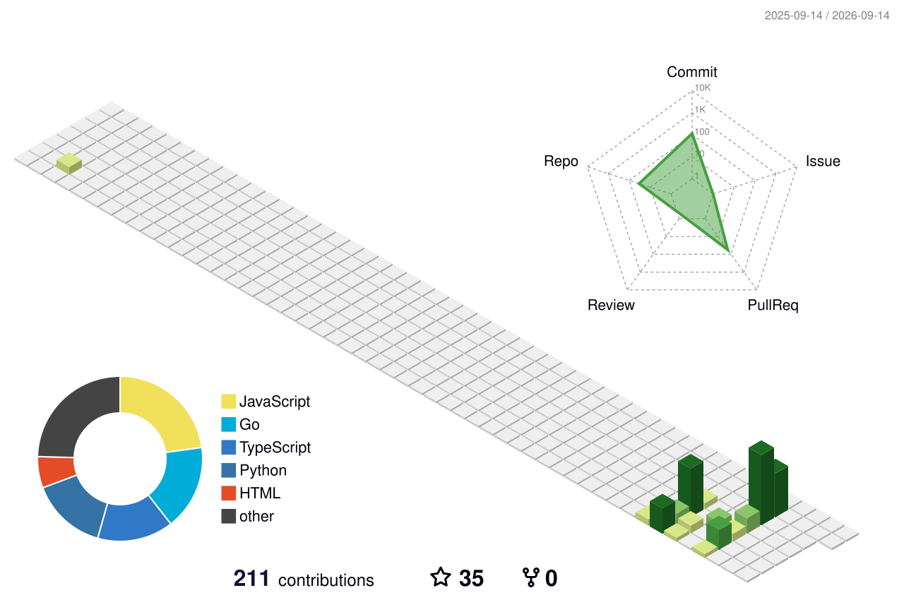

<p align="center">
  
</p>

<div align="center">

</div>

<p align="center">
  
  
  
  
</p>

<pre align="center">
   ┌─[root@matrix]─[~]
   └─$ ./boot.sh --theme=pentest
   [+] loading profile ............ done
   [+] mounting arsenal ........... done
   [+] spawning terminal .......... done
   ┌──────────────────────────────────────┐
   │   M A T H E U S   ::  0xM4T               │
   │   dev by day · recon by night            │
   └──────────────────────────────────────┘
</pre>

---

## ? whoami

```text
root@matheus:~# whoami
matheus — developer by day, recon & red-team learner by night

root@matheus:~# cat about.txt
> Building stuff: APIs, automation, and security/AI tooling.
> Learning path: Pentest -> Red Team -> Offensive Security.
> Vibe: break it, understand it, defend it better.
> Everything here is study / CTF / AUTHORIZED testing only.

root@matheus:~# ./status.sh
[✓] Curious about how things break
[✓] CTF enthusiast (when time allows)
[✓] Writing code that hurts... bugs, not people
```

---

## ?? Arsenal <sub><sup>labs · CTF · estudo</sup></sub>

<p align="center">
  
</p>

<p align="center">
  
  
  
  
  
  
  
  
</p>

> ? Tooling above is for **authorized labs, CTFs and learning**. I don't test what I don't own or isn't explicitly permitted.

---

## ?? Currently

```text
[+] Studying   : Web app pentest, Active Directory, privilege escalation
[+] Building   : security & AI tooling (Go / Python / TS)
[+] Playing    : CTF challenges (web, pwn, recon)
[+] Goal       : OSCP / offensive-security certs (someday)
```

---

## ?? Lab <sub><sup>repos · security × AI</sup></sub>

<p align="center">
  <a href="https://github.com/matheus24scc/ConfidentialAI-Hub"></a>
  <a href="https://github.com/matheus24scc/Sigstore-SBOM-Hub"></a>
  <a href="https://github.com/matheus24scc/Guardrail-Kit"></a>
  <a href="https://github.com/matheus24scc/zkKYC-Bridge"></a>
</p>
<p align="center">
  <a href="https://github.com/matheus24scc/AgentFlow-Studio"></a>
  <a href="https://github.com/matheus24scc/AIOps-Lens"></a>
  <a href="https://github.com/matheus24scc/EdgeML-Flow"></a>
  <a href="https://github.com/matheus24scc/VisionLLM-Kit"></a>
</p>

> ? também: [Backstage-X](https://github.com/matheus24scc/Backstage-X) · [Q-DevKit](https://github.com/matheus24scc/Q-DevKit) · [whatsapp-api](https://github.com/matheus24scc/whatsapp-api) · [matheus24scc](https://github.com/matheus24scc/matheus24scc)

---

## ?? GitHub Stats

<p align="center">
  
  
</p>
<p align="center">
  
</p>
<p align="center">
  
</p>
<p align="center">
  
</p>

---

## ?? 3D Contributions <sub><sup>github-profile-3d-contrib</sup></sub>

<p align="center">
  
</p>

---

## ?? Metrics <sub><sup>terminal-style · via lowlighter/metrics</sup></sub>

<p align="center">
  
</p>

---

## ?? Connect

<p align="center">
  <a href="https://github.com/matheus24scc" target="_blank"></a>
  <a href="https://www.linkedin.com/in/matheus-gabriel-schveitzer-4a2371139/" target="_blank"></a>
  <a href="mailto:mgabriel552@gmail.com" target="_blank"></a>
</p>

<p align="center">
  
</p>

---

> ? **Disclaimer:** this profile is for learning, CTFs and authorized security testing only. No illegal activity. Hack the planet responsibly. ??
